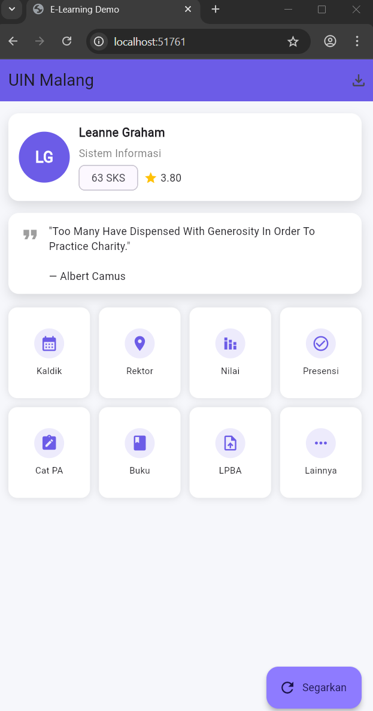
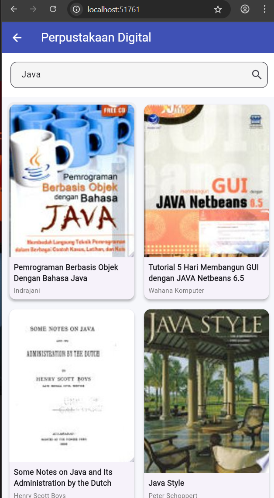
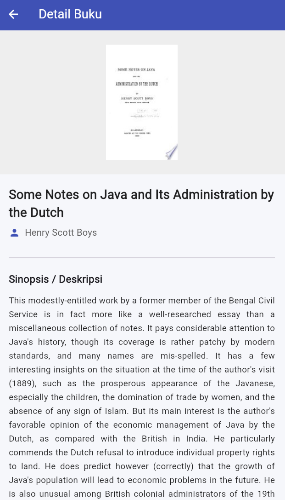
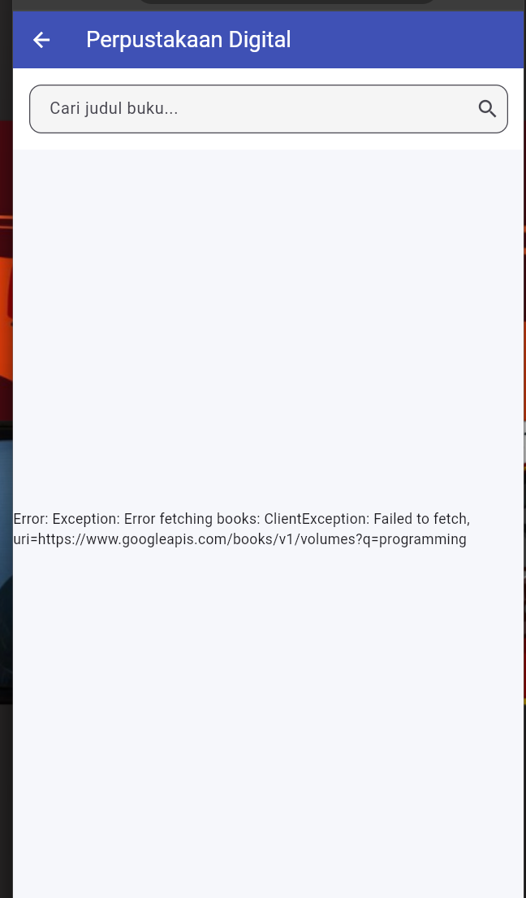

# 📚 EduConnect - Digital Library & E-Learning App

**EduConnect** adalah aplikasi mobile berbasis Flutter yang dikembangkan untuk memenuhi Ujian Akhir Semester (UAS) mata kuliah Mobile Programming. Aplikasi ini telah bertransformasi dari sekadar tampilan statis menjadi aplikasi dinamis yang terintegrasi dengan **RESTful API Publik** untuk menyajikan data buku dan kutipan inspiratif secara *real-time*.

---

## 🖼️ **App Preview**

| Home Page (Quotes) | Book Search | Detail Page | Error Handling |
|:------------------:|:-----------:|:-----------:|:--------------:|
|  |  |  |  |

*(Pastikan Anda mengupdate file gambar di folder assets/ screenshot di repo Anda)*

---

## 🚀 **Fitur Utama (Key Features)**

### 1. 📖 Perpustakaan Digital (Google Books API)
Fitur unggulan yang memungkinkan pengguna mencari jutaan referensi buku.
- **Pencarian Dinamis:** Ketik kata kunci (misal: "Flutter", "Sejarah", "Novel"), dan aplikasi akan mengambil data terbaru dari server.
- **Detail Buku:** Klik pada kartu buku untuk melihat sampul resolusi tinggi, nama penulis, dan membaca **Sinopsis/Deskripsi** lengkap.
- **Image Proxy:** Menggunakan teknik proxy (`wsrv.nl`) untuk menangani masalah CORS pada gambar saat aplikasi dijalankan di Web (Chrome).

### 2. 💡 Daily Quotes (DummyJSON API)
Fitur motivasi harian di halaman Beranda.
- Menampilkan kutipan bijak (*Quotes*) yang berbeda setiap kali aplikasi dibuka atau disegarkan (*Refresh*).
- Data diambil secara acak dari server DummyJSON.

### 3. ⚡ Manajemen State & Asynchronous
- **Loading State:** Menampilkan indikator loading (*CircularProgressIndicator*) saat data sedang diambil.
- **Error Handling:** Menampilkan pesan kesalahan yang ramah pengguna jika koneksi internet terputus atau data tidak ditemukan.
- **Pull-to-Refresh:** Memungkinkan pengguna memperbarui data dengan mudah.

---

## 🔗 **Daftar Endpoint API**

Aplikasi ini menggunakan dua sumber data publik:

| Fitur | Sumber API | Endpoint | Method |
|-------|------------|----------|:------:|
| **Pencarian Buku** | Google Books API | `https://www.googleapis.com/books/v1/volumes?q={keyword}` | `GET` |
| **Quotes Harian** | DummyJSON | `https://dummyjson.com/quotes/random` | `GET` |

---

## 📂 **Struktur Proyek (Architecture)**

Aplikasi menerapkan **Layered Architecture** untuk memisahkan logika bisnis dan tampilan (UI).
